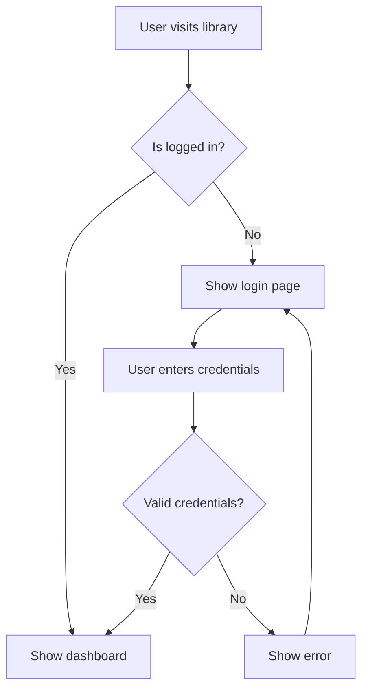
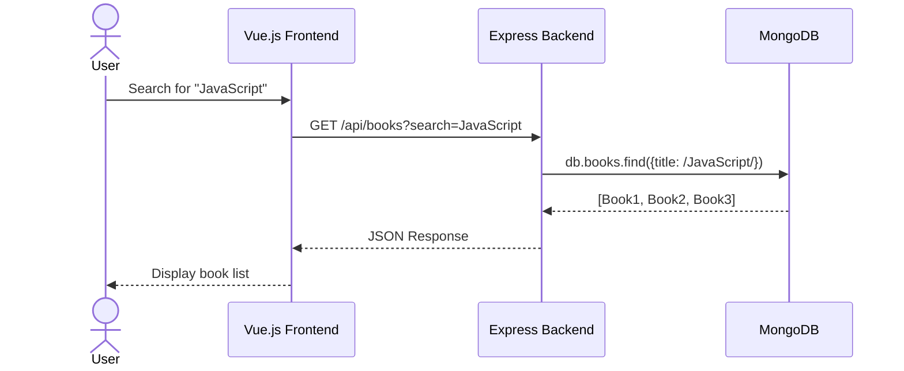
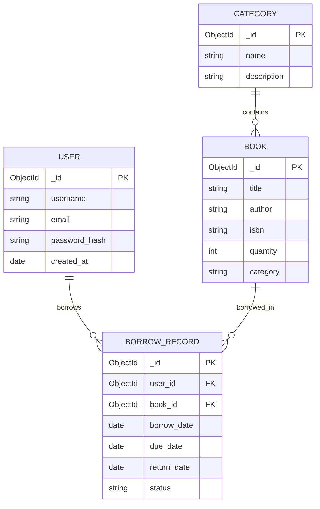
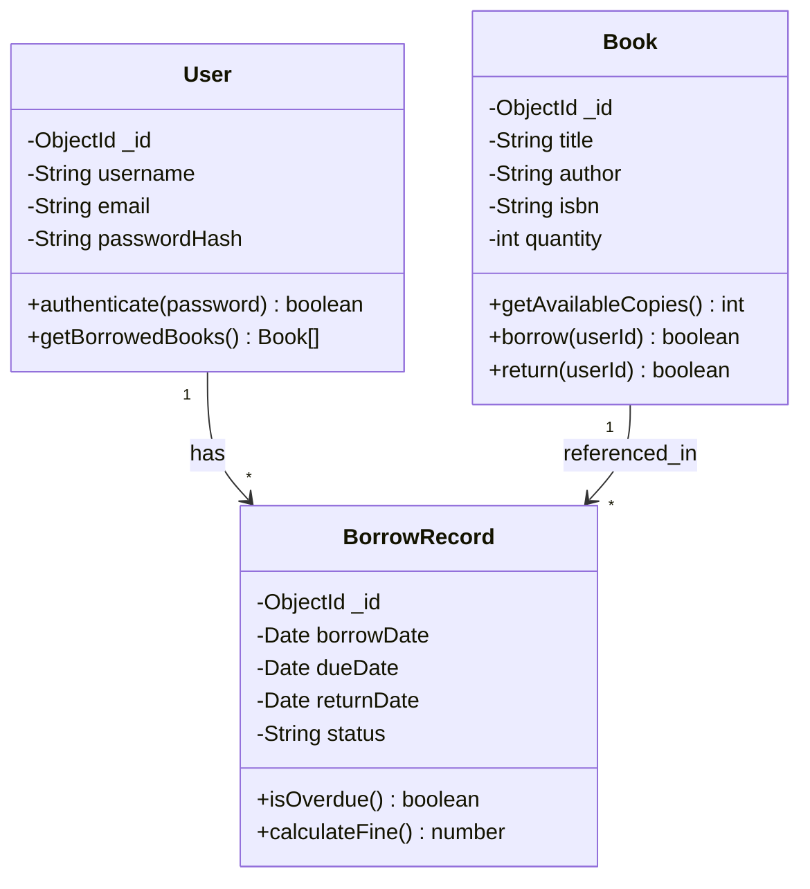
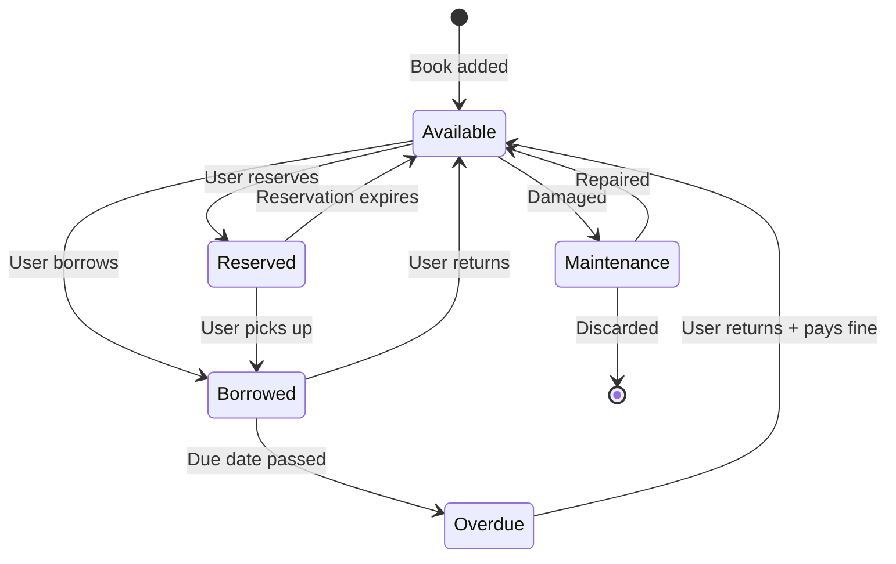
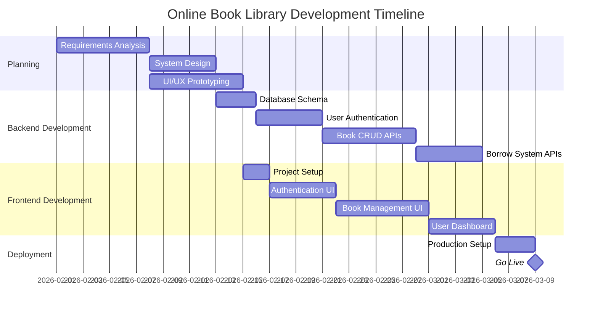
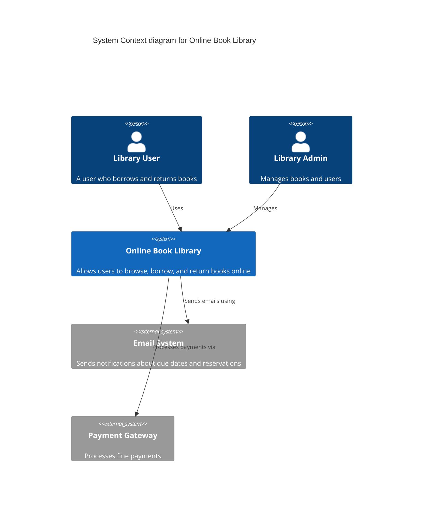

# LAB 2 - Online Book Library System

A full-stack web application for managing an online book library, built with modern development tools and best practices.

## Technology Stack

```
┌─────────────────────────────────────────────────────────────────┐
│                    Online Book Library System                    │
├─────────────────────────────────────────────────────────────────┤
│  Frontend          │  Backend           │  Database              │
│  ─────────         │  ────────          │  ─────────             │
│  Vue.js 3          │  Node.js           │  MongoDB               │
│  Vite              │  Express.js        │  Mongoose              │
│                    │                    │                        │
├─────────────────────────────────────────────────────────────────┤
│  Documentation                                                   │
│  ─────────────                                                   │
│  Markdown                                                        │
│  MermaidJS                                                       │
│  Pencil AI                                                       │
├─────────────────────────────────────────────────────────────────┤
│  AI Development Tools & Workflow                                 │
│  ─────────────────────────────────                               │
│  Spec Kitty (Specification-Driven Development)                   │
│  VS Code + GitHub Copilot                                        │
│  MCP Servers (Serena, DeepWiki, MongoDB, Pencil)                 │
└─────────────────────────────────────────────────────────────────┘
```

## System Architecture

### User Flow



### API Interaction Sequence



### Entity Relationship Diagram



### Class Diagram



### Book State Diagram



### Development Timeline



### System Context (C4)



## Features

- **User Authentication**: Email/password login and registration with JWT
- **Book Catalog**: Browse, search, and filter books with pagination
- **Borrowing System**: Borrow/return books, overdue detection, fine calculation
- **User Dashboard**: View borrowed books, due dates, recommendations
- **Admin Panel**: Add/edit/delete books, view active borrows

## Getting Started

```bash
# Backend
cd book-library/backend
npm install
npm start

# Frontend
cd book-library/frontend
npm install
npm run dev
```
